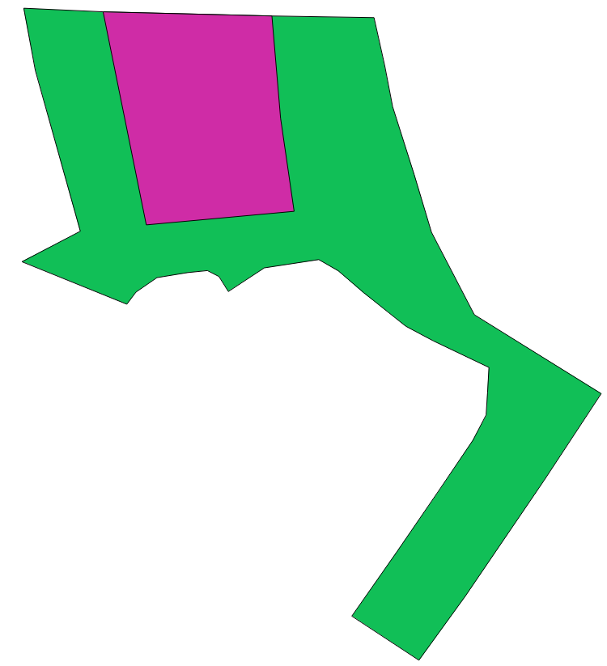

# corrige_setor_censitario_2010
Scripts to correct topological problems in Enumeration Districts (Setores Censitários) of the 2010 Brazilian Census

## Data
(Setores Censitários)

Available from: ftp://geoftp.ibge.gov.br/malhas_digitais/censo_2010/setores_censitarios/
See [import_data](import_data.md.txt), on how to import it into Postgresql/Postgis.

Enumeration Districts  (ED) are smallest areas for which Brazilian Census data is available. The 2010 Census had 318 thousand EDs. 
Created to facilitate Census logistics, EDs defined as areas containing from 250 to 350 households in urban areas and 150 to 250 in rural areas, so that they can be surveyed by one of Census surveyor. 
To avoid double counting or ignoring households, EDs must divide the space in a topologically consistent manner, with no overlaps or gaps. 

While this is true for the census operations, the EDs digital representation, the shape files of Setores Censitários, do have topological problems. 

## Topological problems

We were able to identify 3 types of problems: 

1. Polygon self intersections.

2. "Islands", contained inside other polygons. In reality, polygon A is surrounded by polygon B. This is common for EDs of rural villages that are a created inside the area of a larger urban EDs. Or buildings with many apartments that are defined as separate EDs inside urban EDs.  
Polygon B should have a hole where polygon A is located. But it does not, the area of polygon A is also part of polygon B. 

3. Border overlaps and gaps

Table 1 describes the relative frequency of these problems. Because of the sheer number of EDs, we need to automate, as much as possible, the correction of these topological problems. On the other hand, we don't want corrections that would introduce larger distortions in the polygons. 

## Possible solutions ##
At this moment analyzing possible solutions... See [this question](http://gis.stackexchange.com/q/166143/7505) about "Create mosaic like Voronoi Diagram from disjoint polygons", and [this discussion](https://github.com/lucasmation/osm_cnefe_import/issues/4)...

Summarizing, there are two  main approaches:

1. Use  [topological tools](https://docs.qgis.org/2.2/en/docs/gentle_gis_introduction/topology.html#figure-topological-tools) of GIS systems and human-assisted procedures.

2. Transform all polygons in a "disjoint set" of [simple polygons](http://postgis.net/docs/ST_IsSimple.html), by *st_difference(st_intersection)* procedures... It is the starting point for automatic  (non-assisted) solutions:

  2.1. using a *vector algorithm* ([dicussed here](http://gis.stackexchange.com/q/166143/7505)), or

  2.2. using [*raster algorithm*](http://gis.stackexchange.com/q/166143/7505) (loosing some position-precision but good as the CNEFE-error magnitude). 
